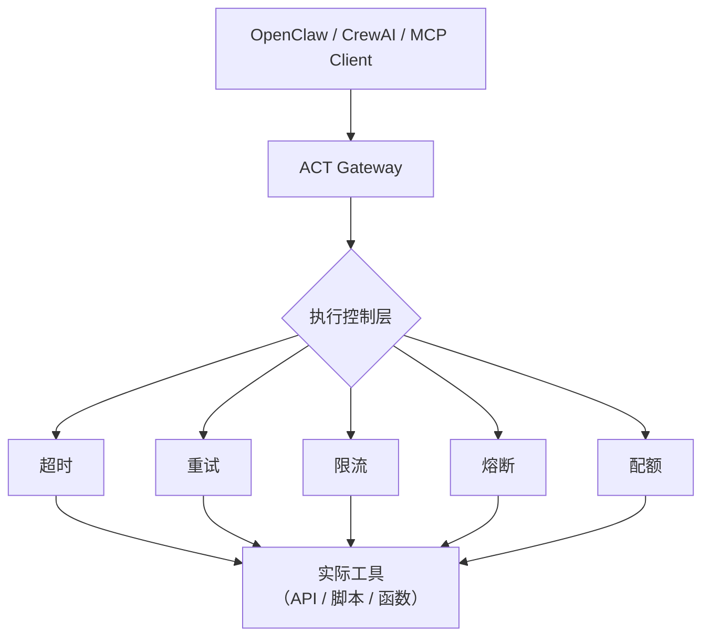

# ACT Gateway – 为 AI Agent 提供生产级执行层

[](https://pypi.org/project/act-openclaw-bridge/)
[](https://opensource.org/licenses/MIT)
[](https://modelcontextprotocol.io)
[](https://github.com/openclaw/openclaw)
[](https://crewai.com)

**ACT Gateway** 是一个轻量级 HTTP 服务，为 AI Agent 的工具调用提供 **超时、重试、限流、熔断、统一返回格式** 等生产级能力。它可以无缝接入 [OpenClaw](https://github.com/openclaw/openclaw)、CrewAI、MCP 等 Agent 框架，让工具执行变得稳定、可观测、可治理。

> 将不可靠的工具调用，变成确定性执行。

## 为什么需要 ACT Gateway？

| 能力 | 原生 Agent 调用 | 通过 ACT Gateway |
|------|--------------|----------------|
| 超时控制 | ❌ 无，可能永久卡死 | ✅ 可配置超时，自动中断 |
| 自动重试 | ❌ 无 | ✅ 可配置重试次数与退避 |
| 限流保护 | ❌ 无，可能被刷爆 | ✅ 令牌桶限流，保护下游 |
| 熔断机制 | ❌ 无，雪崩风险 | ✅ 断路器，自动熔断 |
| 统一返回 | ❌ 各工具格式各异 | ✅ 标准 Envelope，含元数据 |
| 可观测性 | ❌ 无 | ✅ 自动记录延迟、重试次数、剩余配额 |

## 架构



## 一键安装

### Linux / macOS
```bash
curl -fsSL https://raw.githubusercontent.com/deepseek609609-collab/ACT-OpenClaw-Bridge/main/install.sh | bash
```

### Windows (PowerShell 管理员)
```powershell
powershell -ExecutionPolicy Bypass -Command "& { Invoke-WebRequest -Uri 'https://raw.githubusercontent.com/deepseek609609-collab/ACT-OpenClaw-Bridge/main/install.ps1' -OutFile install.ps1; .\install.ps1 }"
```

## 快速验证

```bash
# 检查服务健康
curl http://localhost:9000/health

# 调用示例工具
curl -X POST http://localhost:9000/act/dispatch \
  -H "Content-Type: application/json" \
  -d '{"intent": "weather.get_current", "params": {"city": "Beijing"}}'
```

**返回示例**（Envelope 格式）：
```json
{
  "version": "1.0",
  "execution": {
    "status": "ok",
    "latency_ms": 203,
    "retries": 0,
    "breaker_state": "closed",
    "quota_remaining": 9
  },
  "payload": {"city": "Beijing", "temperature": 22}
}
```

## 生态集成

### 🔌 作为 MCP 执行后端
ACT Gateway 完全兼容 [MCP 协议](https://modelcontextprotocol.io)。任意 MCP 客户端（如 Claude、Cursor）可通过以下端点调用：
- `POST /mcp/tools/list` — 发现所有工具
- `POST /mcp/tools/call` — 调用指定工具

### 🦞 作为 OpenClaw Skill 执行引擎
安装脚本会自动为 OpenClaw 生成 `act-bridge` 技能，并将所有 ACT 工具镜像为 OpenClaw 技能。在 OpenClaw 对话中直接使用：
> “使用 act-weather-get_current 查询北京天气”

### 🚀 与 CrewAI 集成
通过 `crewai_adapter.py` 将 ACT 工具包装为 CrewAI 工具，让 CrewAI Agent 自动获得执行控制能力。

## 安全与治理

- ✅ **默认安全**：超时、限流、熔断强制开启，防止工具拖垮系统
- ✅ **配额管理**：每个工具独立速率限制，防止滥用
- ✅ **参数校验**：严格按照注册的 JSON Schema 校验输入
- ✅ **审计日志**：每次调用记录意图、状态、延迟，便于追溯
- ✅ **危险能力禁用**：默认禁止 `system.run`、`node.invoke` 等敏感操作（可通过配置开启）

## 演示（30 秒看懂）


*实际效果：连续请求 → 限流拒绝；慢请求 → 超时；连续失败 → 熔断*

## 卸载

### Linux / macOS
```bash
curl -fsSL https://raw.githubusercontent.com/deepseek609609-collab/ACT-OpenClaw-Bridge/main/uninstall.sh | bash
```

### Windows
```powershell
Invoke-WebRequest -Uri 'https://raw.githubusercontent.com/deepseek609609-collab/ACT-OpenClaw-Bridge/main/uninstall.ps1' -OutFile uninstall.ps1; .\uninstall.ps1
```

## 贡献指南

欢迎提交 PR、Issue 或参与讨论。请阅读 [CONTRIBUTING.md](CONTRIBUTING.md)。

## 许可证

MIT © ACT Kernel Contributors