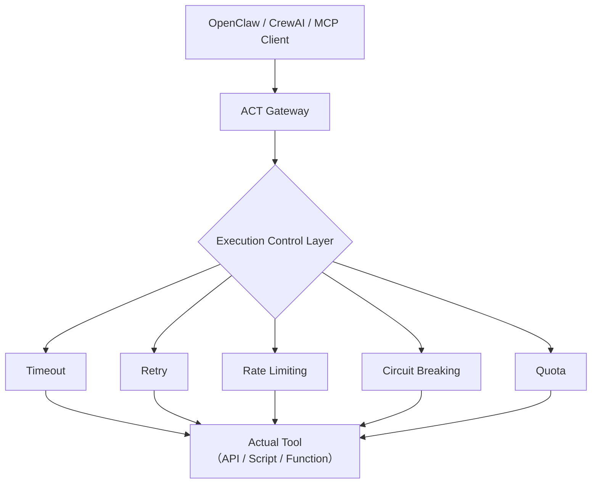

# ACT Gateway – Production-Grade Execution Layer for AI Agents

[](https://pypi.org/project/act-openclaw-bridge/)
[](https://opensource.org/licenses/MIT)
[](https://modelcontextprotocol.io)
[](https://github.com/openclaw/openclaw)
[](https://crewai.com)

**ACT Gateway** is a lightweight HTTP service that provides **timeout, retry, rate limiting, circuit breaking, and unified response format** capabilities for AI Agent tool calls. It seamlessly integrates with [OpenClaw](https://github.com/openclaw/openclaw), CrewAI, MCP, and other Agent frameworks, making tool execution stable, observable, and governable.

> Turn unreliable tool calls into deterministic execution.

## Why ACT Gateway?

| Capability | Native Agent Calls | Through ACT Gateway |
|------------|-------------------|---------------------|
| Timeout Control | ❌ None, may hang forever | ✅ Configurable timeout, auto-interruption |
| Automatic Retry | ❌ None | ✅ Configurable retries with backoff |
| Rate Limiting | ❌ None, risk of being overwhelmed | ✅ Token bucket rate limiting, protects downstream |
| Circuit Breaking | ❌ None, avalanche risk | ✅ Circuit breaker, auto-trip |
| Unified Response | ❌ Each tool has different format | ✅ Standard Envelope with metadata |
| Observability | ❌ None | ✅ Auto-log latency, retry count, remaining quota |

## Architecture



## One-Click Installation

### Linux / macOS
```bash
curl -fsSL https://raw.githubusercontent.com/deepseek609609-collab/ACT-OpenClaw-Bridge/main/install.sh | bash
```

### Windows (PowerShell Admin)
```powershell
powershell -ExecutionPolicy Bypass -Command "& { Invoke-WebRequest -Uri 'https://raw.githubusercontent.com/deepseek609609-collab/ACT-OpenClaw-Bridge/main/install.ps1' -OutFile install.ps1; .\install.ps1 }"
```

## Quick Verification

```bash
# Check service health
curl http://localhost:9000/health

# Call example tool
curl -X POST http://localhost:9000/act/dispatch \
  -H "Content-Type: application/json" \
  -d '{"intent": "weather.get_current", "params": {"city": "Beijing"}}'
```

**Response Example** (Envelope format):
```json
{
  "version": "1.0",
  "execution": {
    "status": "ok",
    "latency_ms": 203,
    "retries": 0,
    "breaker_state": "closed",
    "quota_remaining": 9
  },
  "payload": {"city": "Beijing", "temperature": 22}
}
```

## Ecosystem Integration

### 🔌 As MCP Execution Backend
ACT Gateway is fully compatible with the [MCP protocol](https://modelcontextprotocol.io). Any MCP client (like Claude, Cursor) can call through these endpoints:
- `POST /mcp/tools/list` — Discover all tools
- `POST /mcp/tools/call` — Call specific tool

### 🦞 As OpenClaw Skill Execution Engine
The installation script automatically generates `act-bridge` skill for OpenClaw and mirrors all ACT tools as OpenClaw skills. Use directly in OpenClaw conversations:
> "Use act-weather-get_current to query Beijing weather"

### 🚀 Integration with CrewAI
Use `crewai_adapter.py` to wrap ACT tools as CrewAI tools, giving CrewAI Agents automatic execution control capabilities.

## Security & Governance

- ✅ **Secure by Default**: Timeout, rate limiting, circuit breaking enforced by default, preventing tools from crashing the system
- ✅ **Quota Management**: Independent rate limits per tool, preventing abuse
- ✅ **Parameter Validation**: Strictly validates inputs against registered JSON Schema
- ✅ **Audit Logging**: Records intent, status, latency for each call, easy to trace
- ✅ **Dangerous Capabilities Disabled**: By default blocks sensitive operations like `system.run`, `node.invoke` (can be enabled via config)

## Demo (Understand in 30 Seconds)


*Actual effect: Continuous requests → Rate limit rejection; Slow requests → Timeout; Continuous failures → Circuit breaker opens*

## Uninstallation

### Linux / macOS
```bash
curl -fsSL https://raw.githubusercontent.com/deepseek609609-collab/ACT-OpenClaw-Bridge/main/uninstall.sh | bash
```

### Windows
```powershell
Invoke-WebRequest -Uri 'https://raw.githubusercontent.com/deepseek609609-collab/ACT-OpenClaw-Bridge/main/uninstall.ps1' -OutFile uninstall.ps1; .\uninstall.ps1
```

## Contribution Guidelines

Welcome to submit PRs, Issues, or participate in discussions. Please read [CONTRIBUTING.md](CONTRIBUTING.md).

## License

MIT © ACT Kernel Contributors